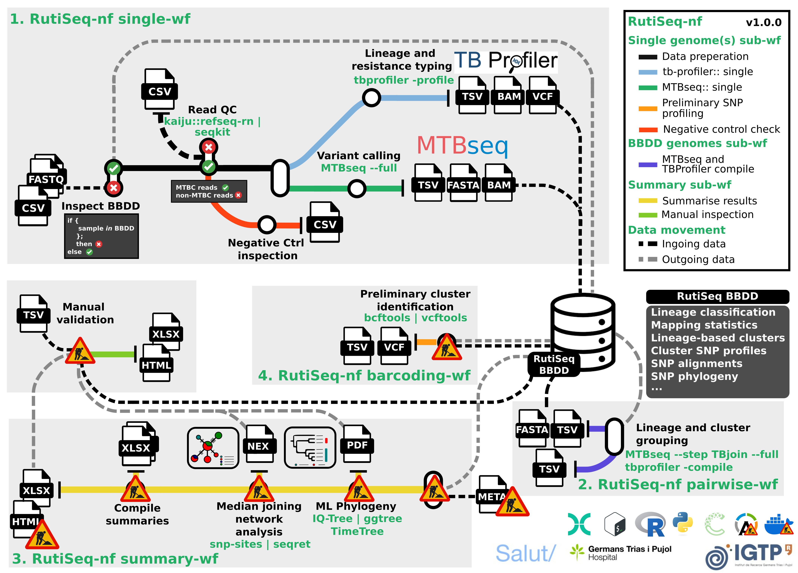

# TBSEQ.cat-nf



## Installation

1. First you need to clone the github repository and pull all the necessary scripts
```{sh}
git clone https://github.com/phesketh-igtp/TBSEQ.cat-nf.git
```
2. Download a kaiju database and add full paths to the <code>nextflow.config</code> file
```{sh}
wget 
```
3. If using conda, you will need to create the conda enviornments Create all the necessay onda environe
```{sh}
```