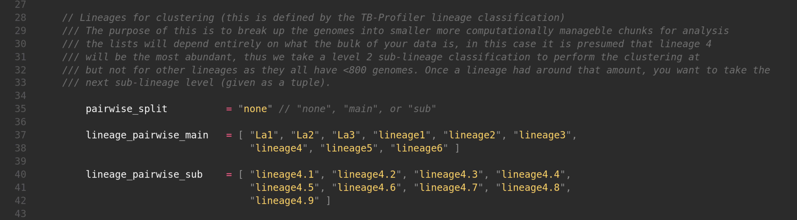

# RutiSeq-nf

This repository is currently under [**active development**] and may not function as intended. Users may encounter bugs, incomplete features, or other issues during use. It is strongly recommended to proceed with caution until a stable release is made available.

## Introduction

**RutiSeq-nf** is intended for the classification and clustering of *Mycobacterium tuberculosis* genomes to support outbreak surveillance. The pipeline is composed of **three sub-workflows**: (1) *single genome analysis*, (2) *pairwise genome* *comparisons*, and (3) *summary reporting*. There are plans to include a fourth sub-workflow for *cluster SNP barcoding*, but this is still a work in progress.

This pipeline is additive in nature, allowing new genomes to be analyzed and appended to an existing database (RutiSeq-DB). This enables ongoing monitoring of TB outbreaks while preserving access to previously processed genomes. As the database grows, it is important to ensure adequate storage. For reference, a database with 1,300 genomes requires approximately 600 GB of storage (excluding raw reads). Optimization is ongoing to retain only essential files and minimize storage occupation.

It is recommended to delete the `work/` directory generated by Nextflow after a successful run to remove duplicate intermediate files and free up storage.


## Main workflow

### Overview

#### Sub-wf 1: Single genomes analysis

The workflow begins by partitioning reads into *samples* and *controls*, based on their designation in the provided sample sheet. Control reads undergo taxonomic classification ([*sylph*](https://github.com/bluenote-1577/sylph)) and quality control statistics ([*seqkit2*](https://bioinf.shenwei.me/seqkit/), [*fastp*](https://github.com/OpenGene/fastp)), *flagging any samples with \>10,000 reads and reads with large fraction of MTBC Reads (WIP)*. Reads are analyzed by [**TB-Profiler**](https://github.com/jodyphelan/TBProfiler) and [**MTBSeq**](https://github.com/ngs-fzb/MTBseq_source) to generate resistance profiles, determine lineages, and perform variant calling. These results are used to populate the RutiSeq-DB — a curated collection of analyzed MTBC genomes for downstream analysis.

If a genome listed in your samplesheet already exists in the RutiSeq-DB, it will not be re-analyzed. Currently, the only way to re-analyze a genome is by manually removing it from the RutiSeq-DB, and re-performing the analysis.

#### Sub-wf 2: Pairwise genome analysis

During this sub-workflow, all genomes previously processed through sub-workflow 1 can be grouped/split for pairwise analysis by lineage (`----pairwise_lv lineage`), sub-lineage (`----pairwise_lv sub`, or `sublineage`) or not at all (`----pairwise_lv none`). Lineage 4 genomes are classified down to level-2 sub-lineages. Genomes from other lineages are initially grouped at the lineage level and should only be subdivided into level-2 sub-lineages once that lineage exceeds >800 genomes. Lineage classification is based on SNP barcoding as defined by TB-Profiler. Within these groups the genomes will complete the MTBSeq analysis (`--TBjoin`, `--TBamend`, and `--TBgroup`), which includes joining SNP profiles, generating SNP alignments, and clustering the genomes at SNP distances (default: **5, 10, 15** - distances and lineages can be modified in the `nextflow.config`).

#### Sub-wf 3: Summary

During this sub-workflow all the outputs from sub-wf 1 and 2 are compile by their essential information, all the raw outputs still remain in the RutiSeq-BBDD for detail consideration. The principal results will be generated in a multi-sheet `XLSX`. This will include (i) Summary of genomes (classification, mapping statistics, genome coverage and quality), (ii,iii) resistance profiles (using both TBDB and the WHO designations), (iv) genomic clusters at designated SNP distances.

Additional outputs include PDFs of SNP phylogeny (ML tree generated with IQ-Tree) colored by cluster identity, and NEX files ready for upload into [PopArt](https://popart.maths.otago.ac.nz/) for visualisation.

> **Sub-wf 4: Cluster SNP barcoding [**WIP**]**
>
> This is an experimental aspect of the workflow that aims to begin characterizing individual SNPs that are designated uniquely to a particular 5 SNP pairwise distance cluster (`--distance 5` in MTBseq). The plan with this sub-wf is to quickly identifying which genomic cluster a particular genome may belong to prior to SNP clustering with the goal of reducing computational resources and speeding up the analysis. All genomes as part of the sub-wf 1 will have their SNP profiles compared to the cluster barcode SNPs and pre allocated a preliminary cluster for clustering in sub-wf 2.
>
> In this workflow, all genomes SNP profiles merged into a single VCF (grouped by lineage), and the SNP profiles of genomes belonging to the same cluster are compared to all other genomes within the same lineage, to calculate the Fts value (fixation index) for each SNP within the cluster population. SNPs that fulfill the following criteria are classified as a cluster specific SNP: - Fts = 1 - Minimum of 20 reads in both strands (20X cov) - Minimum quality of 20 - Not annotated as: *PE/PPE/PGRS*; *maturase*; *phage*; or *13E12 repeat family protein* - Not located in insertion sequences - Not within InDels or in high density regions (\> 3 SNPs in 10 bp)
>
> The script will generate a `BED` file for each unique SNP and its cluster designation and the genomes will re-assessed by this barcoding method. A report will be generated on the quality of the predictions, wether the cluster asignment was no better than random chance, or if there is consistency compared to the MTBSeq cluster assignment (*K-means*).

### Requirements

The following software needs to be available on your path.

- Nextflow
- Package manager (currently conda is supported, Docker and Apptainer are a work in progress)

Clone the github repository to your local machine or HPC.

```{sh}
 git clone https://github.com/phesketh-igtp/RutiSeq-nf
```

Download a Sylph database and add full paths to the `nextflow.config` file as a string of paths seperated by a whitespace. Sylph will accept the databases in this format.

```{sh}
# GTDB r220 database (113,104 species representative genomes) - 24th April, 2024
wget http://faust.compbio.cs.cmu.edu/sylph-stuff/gtdb-r220-c200-dbv1.syldb

# Pre-sketched IMG/VR4.1 database for high-confidence vOTU representatives (2,917,516 viral genomes).
wget http://faust.compbio.cs.cmu.edu/sylph-stuff/imgvr_c200_v0.3.0.syldb
```


Parameters for specific tools, such as MTBseq can also be configured in the config file.

## Inputs and Formatting

#### <u>Sample sheet:</u>

This must be a `CSV` file that contains the following information, including the header:

| originalID | sampleID | forward_path | reverse_path | type |
|---------------|---------------|---------------|---------------|---------------|
| S001_123-AAA-R1 | 1-123-AAA_L1 | /path/to/R1.fastq.gz | /path/to/R2.fastq.gz | sample |
| S002-456-AAA-R1 | 2-456-AAA_L1 | /path/to/R1.fastq.gz | /path/to/R2.fastq.gz | sample |
| CTRL-01-AAA-R1 | CN-1-AAA_L1 | /path/to/R1.fastq.gz | /path/to/R2.fastq.gz | control |

```{sh}
$ cat samples.csv
originalID,sampleID,forward_path,reverse_path,type
sample1_XXX-AAA,1-XXX-AAA_LX,/path/to/R1.fastq.gz,/path/to/R2.fastq.gz
sample2_XXX-AAA,2-XXX-AAA_LX,/path/to/R1.fastq.gz,/path/to/R2.fastq.gz
sampleCN-1-AAA-R1,CN-1-AAA_L1,/path/to/R1.fastq.gz,/path/to/R2.fastq.gz
```

- <u>originalID</u> : Name of the sample. Retaining the original name of your sample in the file is for your own records and will not be used in the pipeline. This is to ensure that you can keep track of your samples and their corresponding reads. The *originalID* can be anything you want, but it is recommended to use a unique identifier for each sample.

- <u>sampleID</u> : The ***alias MUST be unique*** and have the following structure: **[SampleID]_[LibraryID]**. The *sampleID* can be have information separated by hyphens ( - ), **BUT** the undescore ( \_ ) must be reserve for distinguishing between the *sampleID* and the *LibraryID*. This is to satisfy a data naming convention required by MTBseq, which requires reads are name: **[SampleID]-[AaZz]_[LibID]_R{1,2}.fastq.gz**. If the originalID's happen to follow this structure, you can duplicate the IDs in *originalID* and *sampleID*. If a *sampleID* in your sample sheet is duplicated, or that alias already exists in the database, then that sample will not be analyzed. Ensure that each alias is unique within the entire database to avoid this issue.

- <u>forward_path/reverse_path</u> : full path of reads available to the system for accessing the reads. Reads must be gzipped and with the full suffix of `fastq.gz`, not `fq.gz`.

- <u>type</u> : denotes whether reads correspond to a sample *or* control. An error will be produced if a sample is not declared as a *sample* or *control*.

    >Controls and samples are handled separately when analyzed by *TB-Profiler* and *MTBseq* as failures are expected for negative controls. As such, they must be analyzed separately to avoid the workflow collapsing when errors are produced by the negative controls.

#### <u>Metadata [optional]:</u>

Metadata (`CSV`), if provided, is utilized at the summary step when the nexus files are generated for visualising the median-joining networks and performing the molecular clock on concatenated variable possitions within a lineage. If the following metadata is provided with the correct headers, then the nexus files will also contain relevant metadata. If no metadata is provided then these analyses will be omitted.

- The 'date' represents the estimated onset of infection or diagnosis and should follow the **YYYY-MM-DD** format. If the exact date is unknown, you can use partial placeholders (e.g.year only: *2020-XX-XX* or *202X-XX-XX*; year and month: *2024-05-XX*). Providing the full date ensures greater accuracy in predicting ancestral variable positions for each tree node in the phylogenetic tree, which will improve interpretation of median-joining networks outbeak direction.
- The 'location' can be anything you want, the hospital that performed the diagnosis, country of sample origin.

| originalID      | sampleID       | date       | location   |
|-----------------|----------------|------------|------------|
| sample1_XXX-AAA | 001-XXX-AAA_LX | 2024-01-01 | Location A |
| sample2_XXX     | 002-XXX_LX     | 2022-01-02 | Location B |
| sample3_X       | 003-X_LX       | 202X-XX-XX | Location C |

## Usage

On a HPC, the nextflow scripts need to be submitted as a job, and from there nextflow will spawn all the necessary jobs submissions. There is an example running script that is responciple for submitting the `main.nf` script to a HPC named [submit-nf.sh](./submit-nf.sh). This script can be modified to include additional features but for now it functions as needed.

### Required arguments

All these arguments can be passed to the `submit-nf.sh` script, or they can be hardcoded in the `nextflow.config` file. The following arguments are required:

- `--runID` : A unique identifier for the analysis (e.g `--runID "run-1"`; `--runID "library01"`)

- `--samplesheet` : The complete path of the sample sheet use used for the following flag `--samplesheet /path/to/samples.csv`. It is recommended that you keep a dated record of all the samples ran.

- `--metadata` : The complete path of the metadata file used for the following flag `--metadata /path/to/metadata.csv`. This is optional, but if you have it, it is recommended to use it as it will create time-trees and add time metadata to the nexus files.

- `--outDir` : This is where the RutiSeq-BBDD will be stored. Since the RutiSeq-BBDD is consulted during the workflow, it is recommended to hardcode the directory in the `nextflow.config` to prevent creating databased split across your server.

- `--workDir` : This is where all the intermediate files will be stored. It is recommended to use a scratch storage for this, as it will generate high quanities of files that can eventually be removed once the workflow has compelted.

- `--pairwise_split` : This is the level of splitting for the pairwise analysis. It can be set to `none`, `sub`, or `main`. The default is `none`, which means that no splitting will be performed, and all genomes will be analyzed together. If you have a large number of genomes, it is recommended to use `sub` or `main` to split the analysis by lineage or sub-lineage. See workflow modications below for more information.

### Example submissions to a computing clusters

Customisation of the profile.config will be required to ensure that the nextflow script is submitted to the correct computing cluster type. Currently, support is provided for a Sun Grid Engine (SGE) cluster. The following example is for a SGE cluster, but the script can be modified to work with other cluster types.

```{sh}
qsub -S /bin/bash -cwd -V -N nf-main \
        -o qsub-nf.out -l mem_free=6G  \
        /path/to/RutiSeq-nf/submit-nf.sh \
        /path/to/RutiSeq-nf/main.nf \
        --samplesheet /path/to/RutiSeq-nf/test/samples.hpc.csv \
        --outdir /path/to/RutiSeq-nf/RutiSeq-test \
        -profile hpc,SGE,conda_on
```

### Workflow modifications

#### Lineage splitting

The option to split your analysis into smaller pairwise analysis chunks (at lineage or sub-lineage level) is controlled by the `--pairwise_split` parameter. Splitting at the lineage level (`----pairwise_split main`) will group genomes by their main lineage (e.g. L1, L2, L3, L4, etc.), while splitting at the sub-lineage level (`----pairwise_split sub`) will further divide the L4 genomes into their respective sub-lineages (e.g. L4.1, L4.2, etc.). If no splitting is desired, you can set it to `none` (`----pairwise_split none`), which will analyze all genomes together without any lineage-based grouping. This is controlled by the `pairwise_lv` parameter in the `nextflow.config` file.



Splitting the analysis lineage (`----pairwise_split main`), sub-lineage (`----pairwise_split sub`) or not at all (`----pairwise_split none`). This will depend on your dataset and the number of genomes available for analysis. To start with, it is recommended to run the pairwise analysis with no splitting (`--pairwise_lv none`) if you have less than 800 - 1,000 genomes. Once your collection expands beyond this range, you can consider splitting the genomes by lineage or sub-lineage. However, to do this you must ensure that this is specified in the config file.

#### Output directory and working directory

You may also 'hardcode' the output directory with `--outdir /path/to/dir`, if your system has a scratch storage you can set the working directory to produce all the intermediate temporary files there using the `--workDir /path/to/dir`. Add them to the config file for convenience, or pass them as arguments to the `submit-nf.sh` script.

#### Analysis parameters

This workflow is designed to be flexible and adaptable to your specific analysis needs, as possible. You can modify various parameters in the `nextflow.config` or when submitting the command to tailor the analysis to your requirements. Currently the defaul parameters are as specified below.

If there is a specific parameter you would like added to the workflow, please open an issue and specify the parameter. Otherwise, below you can find the current parameters and the modules they are associated with if you want to fork and manually modify the code.

| Parameter | Default value | Description | Software | Module(s) |
| --- | -- | -- |  --- | --- |
| `--fastp_length_required` | 50 | Minimum length of read. | fastp | `ADAPTORS_AND_DOWNSAMPLING` |
| `--fastp_max_reads` | 6000000 | Maximum number of reads required for analysis, will downsample to this number of number of paired-end reads exceed this value. | fastp | `ADAPTORS_AND_DOWNSAMPLING` |
| `--mtbseq_minbqual` | 20 | Minimum base quality score | MTBseq | `MTBSEQ_SINGLE`, `MTBSEQ_LINEAGE_JOINT_AMEND`, `MTBSEQ_LINEAGE_GROUP` |
| `--mtbseq_mincovf` | 4 | Minimum forward strand coverage | MTBseq |`MTBSEQ_SINGLE`, `MTBSEQ_LINEAGE_JOINT_AMEND`, `MTBSEQ_LINEAGE_GROUP` |
| `--mtbseq_mincovr` | 4 | Minimum reverse strand coverage | MTBseq | `MTBSEQ_SINGLE`, `MTBSEQ_LINEAGE_JOINT_AMEND`, `MTBSEQ_LINEAGE_GROUP` |
| `--mtbseq_minphred20` | 4 | Minimum number of Phred quality 20 bases | MTBseq | `MTBSEQ_SINGLE`, `MTBSEQ_LINEAGE_JOINT_AMEND`, `MTBSEQ_LINEAGE_GROUP` |
| `--mtbseq_minfreq` | 75 | Minimum allele frequency (%) | MTBseq | `MTBSEQ_SINGLE`, `MTBSEQ_LINEAGE_JOINT_AMEND`, `MTBSEQ_LINEAGE_GROUP` |
| `--mtbseq_unambig` | 95 | Minimum unambiguous base call percentage | MTBseq | `MTBSEQ_SINGLE`, `MTBSEQ_LINEAGE_JOINT_AMEND`, `MTBSEQ_LINEAGE_GROUP` |
| `--mtbseq_window` | 10 | SNP calling window size | MTBseq | `MTBSEQ_SINGLE`, `MTBSEQ_LINEAGE_JOINT_AMEND`, `MTBSEQ_LINEAGE_GROUP` |
| `--mtbseq_snp_distance` | ["5", "10", "15"] | List of SNP distances for clustering (tuple) | MTBseq | `MTBSEQ_SINGLE`, `MTBSEQ_LINEAGE_JOINT_AMEND`, `MTBSEQ_LINEAGE_GROUP` |
| `--iqtree_bootstraps` | 1000 | Number of bootstrap replicates in IQ-TREE analysis | IQ-TREE | `CONCATENATED_VARIABLE_REGION_PHYLOGENY` |
| `--iqtree_model` | 'GTR+G4' | Evolutionary model used in IQ-TREE  | IQ-TREE | `CONCATENATED_VARIABLE_REGION_PHYLOGENY` |
| `--pairwise_split` | 'none' | The MTBC lineage lv to partition the data for pairwise analysis (`main`, `sub`, or `none`)  | N/A | `PREPARE_PAIRWISE_CHANNELS` |
| `--filt_min_depth` | 50 | Filtering value for the minimum depth of coverage (as calculated by MTBseq) for genome to be used in MTBseq pairwise analysis | MTBseq | `COMPILE_SEQUENCING_STATS` |
| `--filt_min_cov` | 0.95 | Filtering value for the beadth of coverage (as calculated by MTBseq) for genome to be used in MTBseq pairwise analysis | MTBseq | `COMPILE_SEQUENCING_STATS` |
| `--filt_min_reads` | 1000000 | Filtering value for the minimum number of reads (as calculated by MTBseq) for genome to be used in MTBseq pairwise analysis | MTBseq | `COMPILE_SEQUENCING_STATS` |

## Output file architecture

```{sh}

```