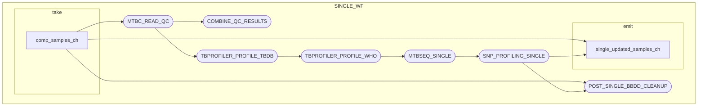

```mermaid
flowchart TB
    subgraph SINGLE_WF
    subgraph take
    v0["comp_samples_ch"]
    end
    v8([MTBC_READ_QC])
    v10([COMBINE_QC_RESULTS])
    v11([TBPROFILER_PROFILE_TBDB])
    v12([TBPROFILER_PROFILE_WHO])
    v13([MTBSEQ_SINGLE])
    v14([SNP_PROFILING_SINGLE])
    v18([POST_SINGLE_BBDD_CLEANUP])
    subgraph emit
    v19["single_updated_samples_ch"]
    end
    v0 --> v8
    v8 --> v10
    v8 --> v11
    v11 --> v12
    v12 --> v13
    v13 --> v14
    v0 --> v18
    v14 --> v18
    v0 --> v19
    v14 --> v19
    end
```